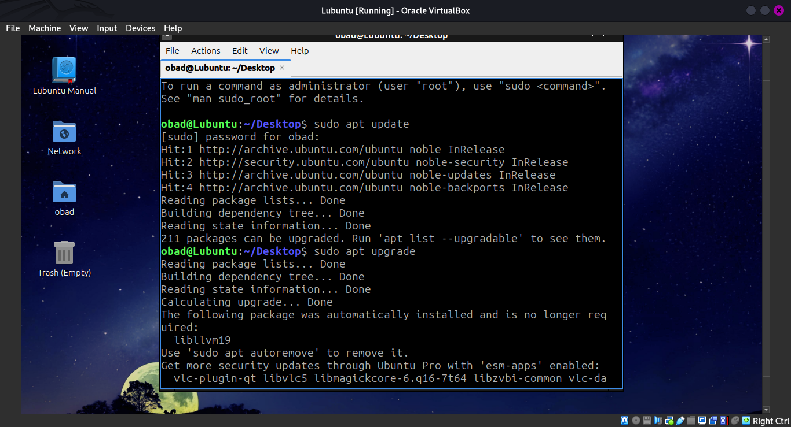
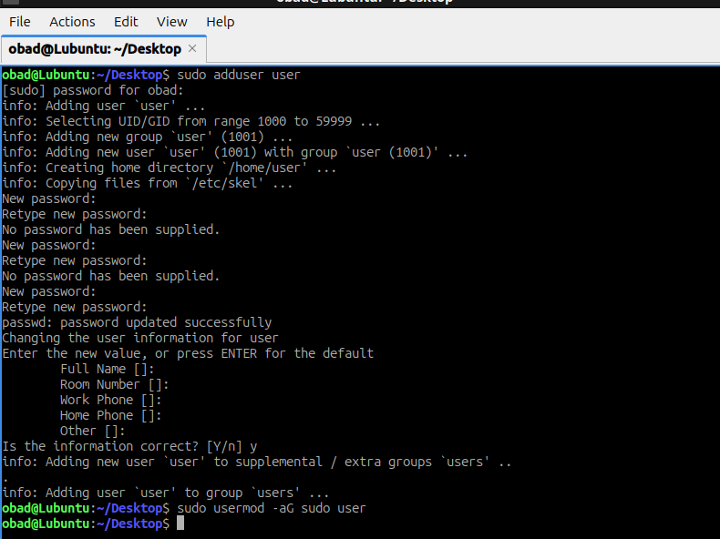
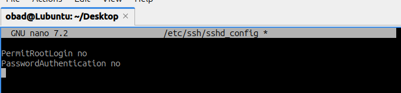
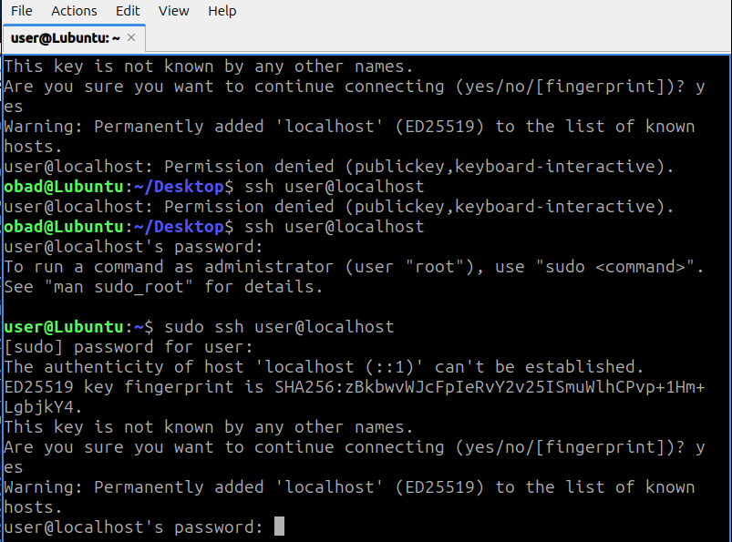
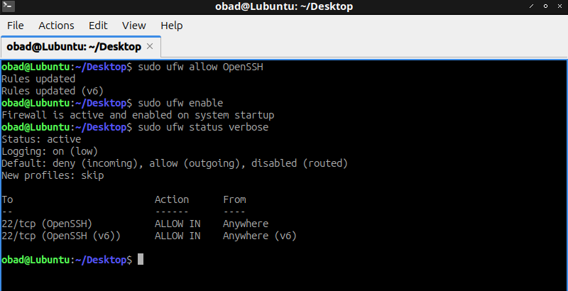
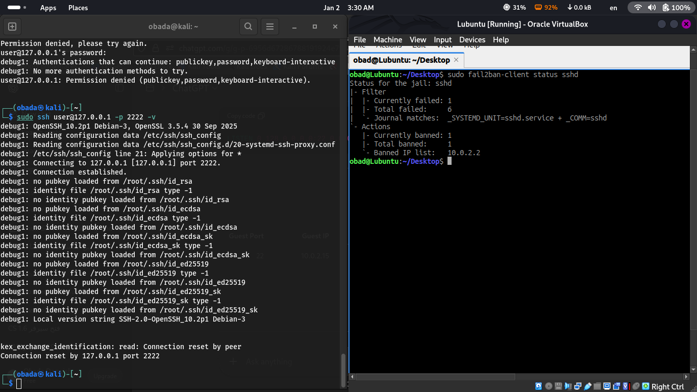
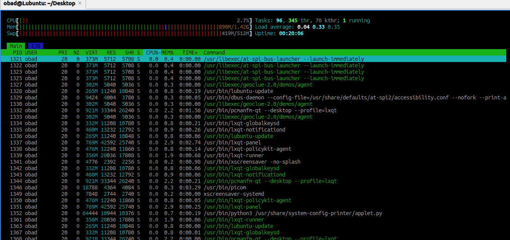
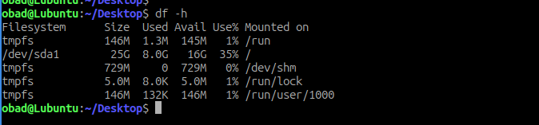
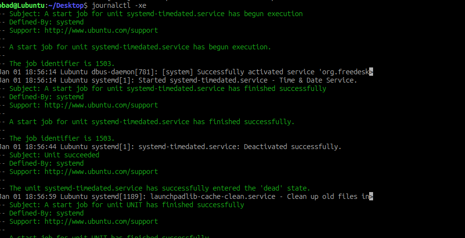
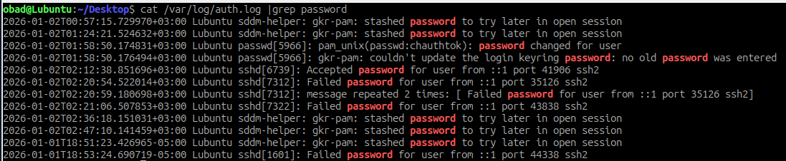

# 🔐 Linux Server Hardening & Monitoring Lab

> **Author:** Obada Darwish 
> 
> **Environment:** Kali Linux (Host) + Ubuntu/Lubuntu (Guest VM)
> 
> **Focus:** Server installation, security hardening, monitoring, and log analysis

---

## 📌 Project Overview
This lab demonstrates a **complete Linux server setup and hardening process**, starting from installation up to security monitoring and log analysis. The goal is to simulate a **real-world secured Linux server** suitable for SOC / Junior SysAdmin / Cybersecurity roles.

---

## 🧱 System Requirements

- VirtualBox / VMware
- Kali Linux (Host)
- Ubuntu / Lubuntu (Guest)
- NAT Network Adapter
- Internet access

---

## 💿 Step 1: Lubuntu Installation


Instead of documenting the installation manually, the Lubuntu installation on VirtualBox follows a **standard and well-documented process**.

🔗 **Reference (GitHub):**  
https://mushahidhkhan.medium.com/installation-of-lubuntu-on-oracle-virtual-box-and-making-it-work-in-full-screen-mode-8b60f1cf4d87

This guide covers:
- Creating the VirtualBox VM
- Attaching the Lubuntu ISO
- Installation steps
- Post-install basic configuration

---

## 🔄 Step 2: System Update
- Updated all packages to latest versions

```bash
sudo apt update && sudo apt upgrade -y
```



---

## 👤 Step 3: User Management
- Created a new non-root user
- Added user to sudo group

```bash
sudo adduser user
sudo usermod -aG sudo user
```



---

## 🔑 Step 4: SSH Hardening

### 🔐 SSH Configuration
- Disabled root login
- Changed default SSH settings
- Enabled key-based access

```bash
sudo nano /etc/ssh/sshd_config
```



### ✅ SSH Login Test


---

## 🔥 Step 5: Firewall (UFW)
- Enabled UFW
- Allowed SSH only

```bash
sudo ufw allow ssh
sudo ufw enable
```



---

## 🚫 Step 6: Fail2Ban Protection
- Installed Fail2Ban
- Protected SSH from brute-force attacks

```bash
sudo apt install fail2ban -y
```

### 📊 Fail2Ban Status
In this step, I simulated a **brute-force attack** on the SSH service from the **Kali Linux machine** by attempting multiple failed login attempts.

Fail2Ban successfully detected the suspicious activity and **automatically banned the attacking IP address** after exceeding the allowed number of retries.

To verify this, I checked the Fail2Ban service status and the SSH jail status.



---

## 📈 Step 7: System Monitoring

### 🖥️ htop
- Monitored CPU & RAM usage



### 💾 Disk Usage
```bash
df -h
```



---

## 📜 Step 8: Log Analysis

### 📘 journalctl
- Reviewed system logs
- Filtered SSH service logs

```bash
journalctl -xe
```



To analyze SSH login activity, I filtered system logs using `journalctl` combined with `grep`.

This allowed me to:
- View SSH authentication attempts
- Identify failed and successful logins


🔍 **Command used:**

```bash
journalctl | grep sshd


### 🔎 Authentication Logs
- Checked `/var/log/auth.log`



---

## 🌐 Networking Notes
- Ubuntu VM running inside Kali Linux
- Network Adapter set to **NAT**
- Ping between VMs tested and verified

---

## ✅ Final Result
✔ Secure Linux server
✔ SSH hardened
✔ Firewall enabled
✔ Brute-force protection active
✔ Logs monitored and analyzed

---

## 🧠 Skills Demonstrated
- Linux Administration
- Server Hardening
- SSH Security
- Firewall Configuration
- Log Analysis
- SOC Fundamentals

---

## 🚀 Conclusion
This lab simulates a **real production-ready Linux server** with security best practices applied. It reflects hands-on skills required for **Cybersecurity, SOC, and System Administration roles**.

---

> 🔥 *"Security is not a product, it's a process."*

